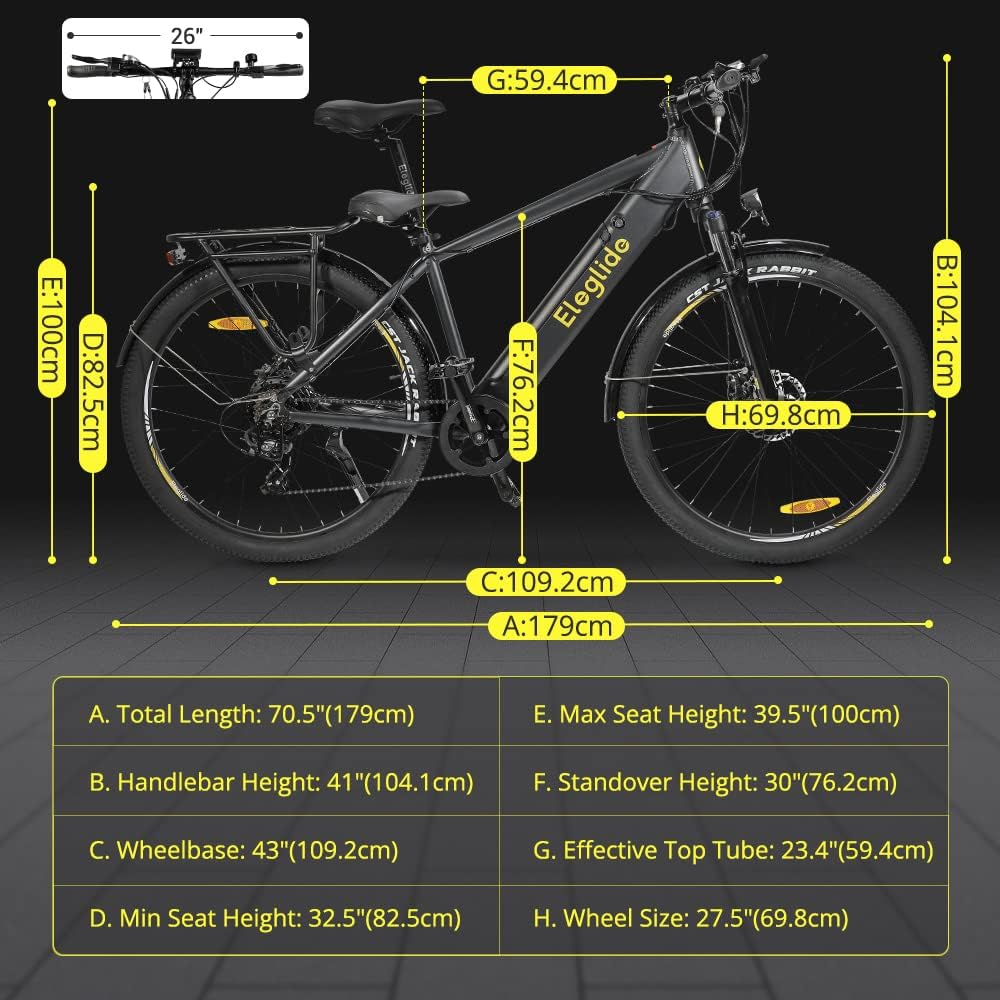

# E-Bike Dataset

 <!-- Replace with an image related to E-bikes -->

Welcome to the E-Bike Dataset repository! This dataset contains information about electric bicycles (E-bikes) collected from various sources. Whether you're a researcher, data scientist, or enthusiast, this dataset can provide valuable insights into E-bike usage, trends, and more.

## Table of Contents

- [Introduction](#introduction)
- [Dataset](#dataset)
- [Usage](#usage)
- [Battery](#battery)
- [Contributing](#contributing)

- [Contact](#contact)

## Introduction

Electric bicycles, or E-bikes, have emerged as an innovative solution to urban mobility challenges. The surge in interest and adoption of E-bikes has sparked the need for reliable data to understand their impact on transportation ecosystems, the environment, and urban planning. The goal of this dataset is to address these needs by offering a well-structured and curated collection of E-bike-related information.

### Why Collect This Data?

The collection of E-bike data serves several key purposes:

- **Transportation Planning**: Urban planners and policymakers can use this data to study E-bike usage trends and integrate them into existing transportation infrastructure.
- **Environmental Impact**: By analyzing E-bike adoption rates, we can better understand their contribution to reducing carbon emissions and promoting sustainable mobility.
- **User Behavior Analysis**: The dataset allows researchers to explore user behavior, preferences, and demographics, aiding in the design of user-centric E-bike services.
- **Infrastructure Improvements**: Data on popular E-bike routes and usage times can help optimize cycling infrastructure and charging station placements.

### Potential Studies

Researchers, data scientists, and policymakers can conduct a range of studies using this dataset:

- Analyzing peak usage hours and locations to inform E-bike sharing system deployment.
- Studying the relationship between weather conditions and E-bike ridership.
- Investigating user demographics and factors influencing E-bike adoption in various regions.
- Modeling the impact of E-bike usage on traffic congestion and air quality.

### Challenges

Collecting and curating E-bike data presents certain challenges:

- **Data Privacy**: Ensuring the anonymization of user data to protect individuals' privacy while providing useful insights.
- **Data Heterogeneity**: Integrating data from various sources with potentially different formats and granularity.
- **Spatial and Temporal Variability**: Dealing with variations in usage patterns across different cities, times of day, and weather conditions.

### Future Features

We are actively working on enhancing this dataset with the following features:

- Real-time Data Integration: Integrating live E-bike usage data to provide up-to-date insights.
- Enhanced User Demographics: Gathering more comprehensive demographic information to enable deeper user behavior analysis.
- Predictive Models: Developing predictive models to forecast E-bike demand and optimize distribution strategies.

We encourage contributions from the community to help us expand and improve this dataset for the benefit of researchers, urban planners, and E-bike enthusiasts.

Feel free to explore the data, conduct your analyses, and contribute to our shared understanding of the role of E-bikes in sustainable urban mobility.


## Dataset

The dataset is organized into the following categories:

- **Usage Data**: Information about E-bike rides, including **speed**, **distance**, **duration**, **starting/ending locations**, **altitudes**, **cadence**, **temperature** and **timestamps**.
- **Technical Specifications**: Details about the E-bike models, including battery capacity, motor power, weight, and dimensions.
- **Collector Demographics**: Aggregate statistics on e-bike data collectors, such as age, gender, height and weight.
Note: All information is within certain intervals and accurate data will not be provided to protect the privacy of the researcher..

The dataset has only one format at this stage: CSV. In the future, we will add new formats (e.g. JSON). Please refer to the [data](data/) directory for the complete dataset files.

## Usage

You are free to use this dataset for research, analysis, visualization, and other purposes. If you use this dataset in your work, we kindly request that you provide appropriate attribution by linking back to this repository.

### Example Analysis


Here's a simple example of how you can load and visualize the dataset using Python:

```python
import pandas as pd
import matplotlib.pyplot as plt

#### Load the usage data
usage_data = pd.read_csv('data/usage_data.csv')

#### Visualize ride duration distribution
plt.hist(usage_data['duration_minutes'], bins=20, edgecolor='k')
plt.xlabel('Ride Duration (minutes)')
plt.ylabel('Frequency')
plt.title('E-Bike Ride Duration Distribution')
plt.show()
```

## Battery
Motor & Large Battery：This e-bike comprises a 250W powerful brushless motor with 50N.M torque that provides with constant and strong power and enables the bike to speed up to 25km/h. With a replaceable 450Wh lithium-ion battery, it can run up to 100km(62mi) in assist mode.


## Contributing

We welcome contributions from the community to enhance and expand this dataset. If you have additional data sources, improvements to existing data, or insights to share, please consider submitting a pull request. For more details on how to contribute, please refer to the contributing guidelines.

### How We Can Contribute

1. **Data Enhancement**: Help us improve the dataset by adding more diverse samples, fine-tuning existing data, and ensuring data quality. This will enhance the robustness and accuracy of energy consumption and usage patterns in different scenarios.

2. **Feature Engineering**: Contribute by proposing new features that could enhance the accuracy of energy prediction models. This could involve considering weather data, terrain information, or user behavior metrics as potential predictors.

3. **Model Development**: In machine learning and predictive modeling area, we can create and share energy consumption prediction models based on this dataset. These models can serve as valuable benchmarks for future research.

4. **Intelligent Transportation Insights**: Analyze the dataset to extract insights about E-bike usage patterns that can inform intelligent transportation systems. Identify factors influencing ride choices, predict peak usage times, and propose strategies for optimizing E-bike sharing systems.

5. **Validation and Testing**: Test existing models and algorithms against the dataset to validate their performance. This will help ensure that predictions and recommendations derived from this dataset are reliable and accurate.

### Future Innovations

By contributing to this dataset, we're not only helping advance current research but also shaping the future of sustainable urban mobility and transportation technology. Here are some areas where our contributions can make a difference:

- **Energy Prediction Models**: Our insights and contributions can lead to more accurate models for predicting E-bike energy consumption. These models can guide riders to optimize battery usage and improve overall efficiency.

- **Intelligent Routing**: As E-bikes become integrated into urban transportation networks, intelligent routing algorithms can leverage this dataset to suggest optimal routes based on factors like traffic conditions and terrain.

- **Urban Planning**: Analyzing E-bike usage patterns can provide valuable information for urban planners aiming to design efficient cycling infrastructure and optimize traffic flow.

### Get Involved

To contribute, follow these steps:

1. Fork this repository.
2. Create a new branch for your contribution.
3. Make your changes and improvements.
4. Submit a pull request outlining the changes you've made.

Remember that by contributing, we're not only enhancing the dataset but also advancing research in energy prediction modeling and intelligent transportation systems. Our work can have a lasting impact on the future of urban mobility.

We're excited to collaborate with you and see how this dataset can drive innovations in sustainable transportation!


## Contact

If you have any questions, suggestions, or feedback regarding this dataset or repository, please feel free to contact us at hongyuan.fang6@gmail.com.

Happy analyzing!
